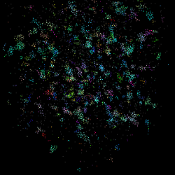
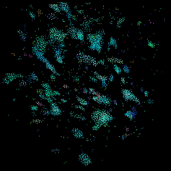
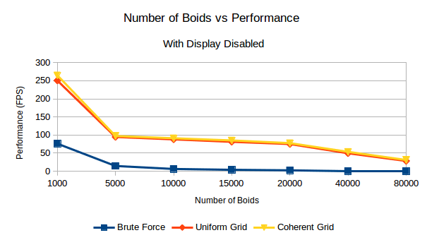
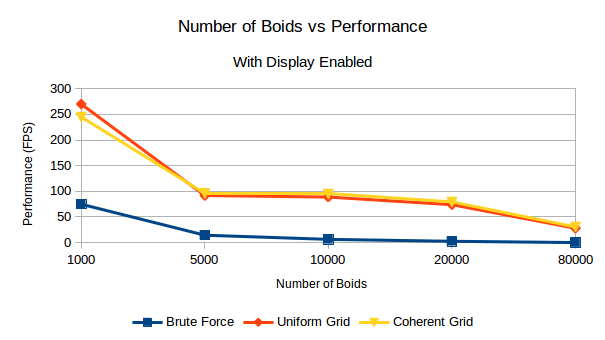
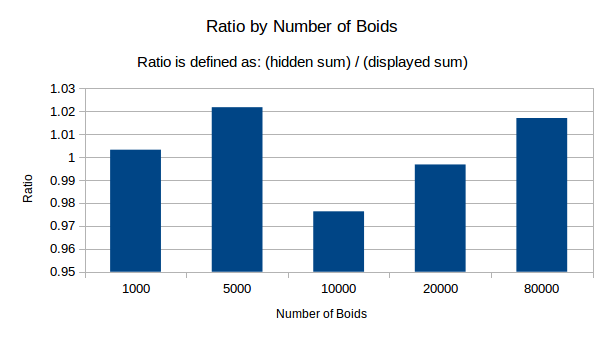
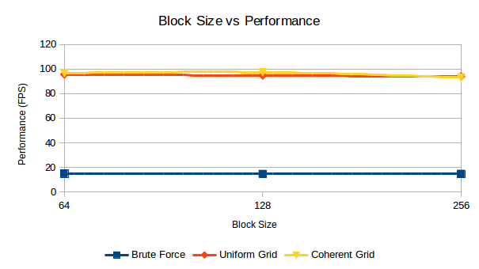

**University of Pennsylvania, CIS 565: GPU Programming and Architecture**

Project 1 - Flocking
====================

* Edward Atter
  * [LinkedIn](https://www.linkedin.com/in/atter/)
  * Tested on: Linux Mint 18.3 Sylvia (4.13.0-41-generic), Ryzen 7 2700x @ 3.7 ghz (base clock) 16GB, GTX 1070 TI 8GB GDDR5 (Personal)
  * CUDA 9

## Overview

  

## Performance

#### Number of Boids

As expected, performance decreases as the number of boids increases. The brute force (naive) quickly became unresponsive. While it did not crash, it was impossible to rotate the cube. Each trial after 10000 boids had to be force quit. 

The uniform and coherent grid searches, on the other hand, performed much better. Staying responsive even after displaying 80000 boids, though with a significant drop in frame rate. 

Disabling the display had much less of an effect than I expected. I'm interested to find out if the results are the same on Windows machines. The bar graph above displays the ratio of (display disabled performance)/(display enabled performance). Thus, a ratio of "1" means the two are exactly equal, while a ratio above one suggests there is a performance benefit from disabling the display. I anticipated disabling the display to have a very large impact, but the data shows the affect was negligible, showing no statistically significant difference. 

I noticed whenever the simulation would run, a single thread on my processor would stay constantly at 100%. Could this have created a bottleneck, explaining the odd results above?

#### Blocksize

Changing the block size did not have a significant affect on performance. 

## Questions

**Question:** For each implementation, how does changing the number of boids affect performance? Why do you think this is?

**Answer:** Across all three methods, framerate dropped as the total number of boids increased. This makes sense, more boids means there will be more objects to process, compute velocities for, and eventually update the screen. As the number of boids increase and the resolution stays the same, more boids will fall within the various rule distances and grid searches, resulting in even more performance loss.

* * *

**Question:** For each implementation, how does changing the block count and block size affect performance? Why do you think this is?

**Answer:** Changing the block size / count had no affect on performance. I believe this was because the number of boids to be processed far outnumbered the block size anyway. If a block is "too small", in theory the GPU could schedule two smaller blocks and have nearly the same performance, less a little for scheduling overhead. 

* * *

**Question:** For the coherent uniform grid: did you experience any performance improvements with the more coherent uniform grid? Was this the outcome you expected? Why or why not?

**Answer:** Implementing the coherent uniform grid did yield a marginal increase in performance. This was expected, we removed some memory accesses. As an added benefit, without the middle layer being accessed, the GPU no longer had it in its cache, leaving more room for the values we did care about and less cache misses overall.

* * *

**Question:** Did changing cell width and checking 27 vs 8 neighboring cells affect performance? Why or why not? Be careful: it is insufficient (and possibly incorrect) to say that 27-cell is slower simply because there are more cells to check!
**Answer:** This did not affect performance. At first, this may sound counterintuitive. However, even though 27 cells must be checked instead of 8, each cell became smaller, so the same total surrounding area around a boid remains the same. It would be interesting to evaluate this more in depth and look at affects on memory usage and caching.

## Misc.

#### Edits to CMakeLists.txt

`src/CMakeLists.txt` was updated to increment the architecture value from 20 to 30. 

    cuda_add_library(src
        ${SOURCE_FILES}
        OPTIONS -arch=sm_30
    )

